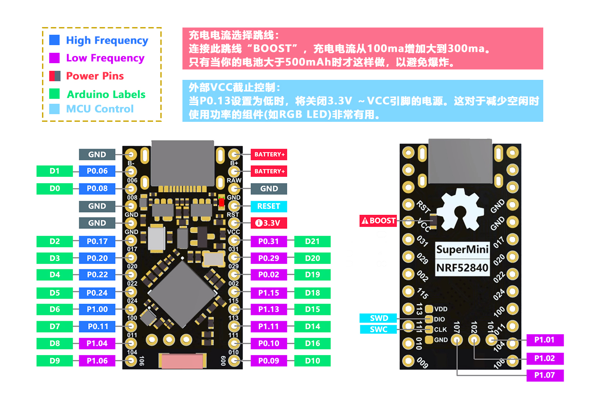

.. _promicro_nrf52840:

Pro Micro nRF52840
########

Overview
********

The ProMicro NRF52840 is a Pro Micro replacement development board that is compatible 
with the Nice!Nano. Its pinout is identical to the ProMicro, meaning it can be used 
with almost any ProMicro keyboard. The NRF5280 development board has a 3.7V lithium 
battery connector and a software switch that cuts off the power to the LED. 
When it is off, the standby power consumption can reach 1mA.

nRF52840 is a high-performance, low-power wireless SoC chip launched by 
Nordic Semiconductor of Norway. It supports multiple wireless protocols, 
including Bluetooth 5, Thread, Zigbee, ANT and 2.4GHz. The nRF52840 chip uses an 
ARM Cortex-M4F processor with a main frequency of 64MHz, built-in 1MB flash memory 
and 256KB RAM. It also has a variety of peripherals, including ADC, PWM, SPI, I2C, 
UART, USB and GPIO. In addition, nRF52840 also supports multiple 
security functions, such as AES encryption, SHA-256 hashing and 
True Random Number Generator (TRNG).

     Pro Micro nRF52840 (Credit: nologo.tech)

More information about the board can be found at 
https://www.nologo.tech/product/otherboard/NRF52840.html.

Hardware
********
Supported Features
==================
Powerful wireless capabilities: Bluetooth 5.0, onboard antenna
Powerful CPU: nRF52840 chip uses ARM Cortex-M4F processor, 
main frequency is 64MHz, built-in 1MB flash memory and 256KB RAM
Battery charging chip: supports lithium battery charging and discharging
Power consumption: Standby power consumption can reach ~20uA

Power supply
============
ProMicro nRF52840Supports 3.7V lithium battery charging and discharging, 
charging rate is 100mA, so a 2000mAh battery takes 20 hours to fully charge.

WARNING: 
When BOOST is connected, the charging current increases from 100ma to 300ma,
only when the capacitor capacity More than 500mAhYou can connect only 
whenAvoid explosions 💥.

External VCC Control:
When P0.13 is set low, the power to the 3.3V, VCC pin is turned off. 
This is useful for reducing components that use power when idle (such as RGB, LED).

Programming and Debugging
*************************

Flashing
========
If you want to enter the Bootloder (UF2), please short RST to GND twice within 0.5S.
Enter the Bootloder and connect the computer via USB.
A storage device called Nice!Nano will be displayed. 
You can drag and drop the .uf2 file to burn the program.

SWDIO/CLK pins are routed at the bottom of the PCB.

Debugging
=========

Refer to the :ref:`nordic_segger` page to learn about debugging Nordic boards with a
Segger IC.

References
**********
https://github.com/adafruit/Adafruit_nRF52_Bootloader
